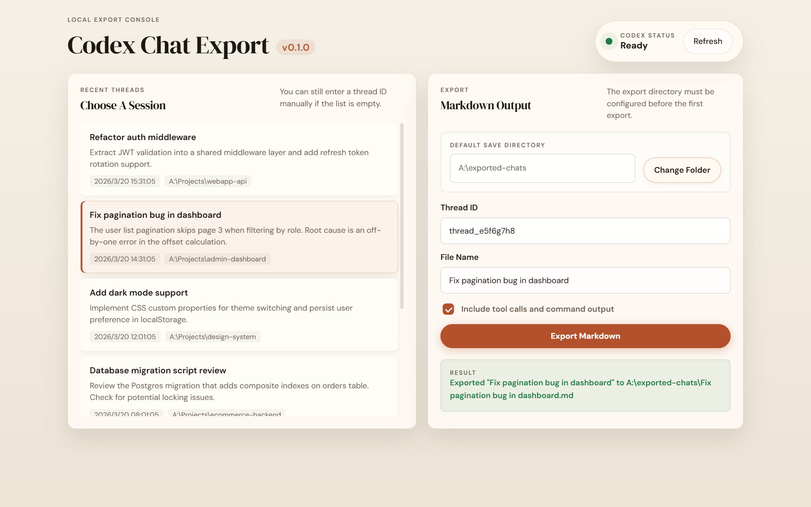

*Vibe coded.*

# Codex Chat Exporter v0.1.0

将 Codex 对话线程导出为 Markdown 文件。



## 环境要求

- Node.js 已加入 PATH
- `codex` CLI 已加入 PATH（通过 `codex app-server` 使用）
- GUI 的文件夹选择功能仅支持 Windows

无需安装步骤。本项目仅使用 Node.js 内置模块，无需包管理器或 `npm install`。

## 图形界面（GUI）

在项目根目录运行：

```
node gui/server.js
```

然后在浏览器中打开 `http://127.0.0.1:8787`。

首次运行时，会弹出系统文件夹选择框，让你设置默认导出目录。该设置保存在 `.ai/gui-settings.json` 中，后续运行时自动读取。

在 GUI 中可以：

- 从最近的 Codex 线程列表中选择一个
- 或手动输入线程 ID
- 勾选"Include tool calls"以包含计划、命令和文件变更内容
- 点击 Export 写出 Markdown 文件

## 输出内容

每次导出生成一个 `.md` 文件，按顺序包含完整对话：用户消息与 Codex 回复。

启用 `--with-tools`（或 GUI 中勾选对应选项）后，输出还会包含工具调用详情：计划步骤、推理过程、Shell 命令及文件编辑内容。

## 测试

```
node --test
```

测试文件：`gui/server.test.js`、`script/export-core.test.js`、`script/export-codex-thread.test.js`。